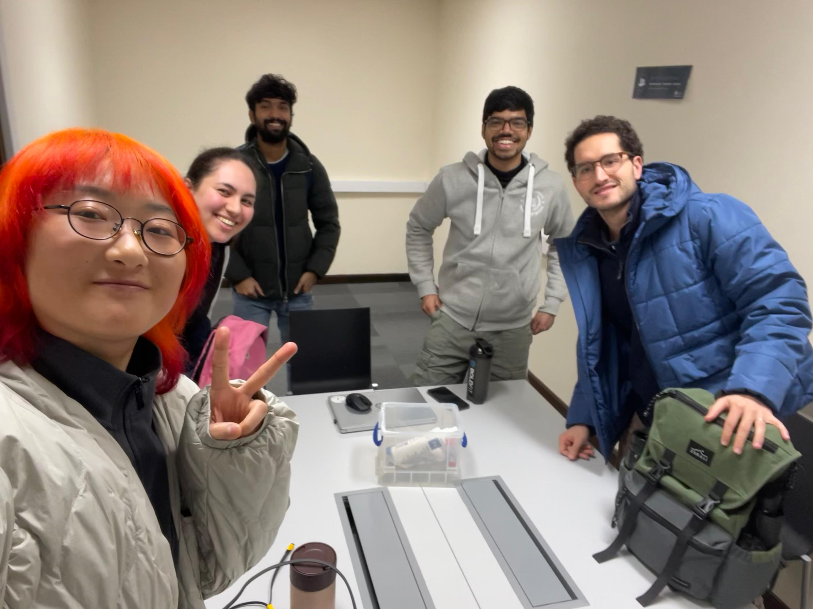
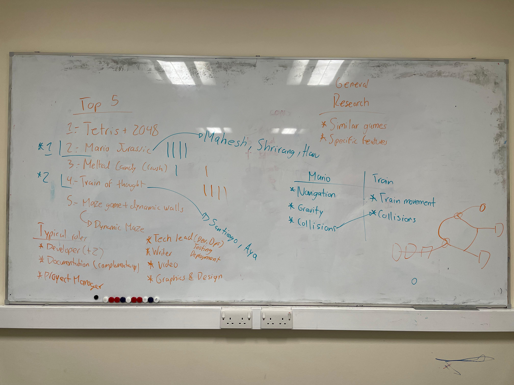

## 2025 Week3 Meeting 3

## 1. Meeting Information
- **Date**: 2025-01-23
- **Time**: 11:00-12:00 & 13:00-14:00
- **Location**: [Chemistry Library Group Room 1 & Room 2]
- **Participants**: Haru, Shrirang, Mahesh, Aya, Santiago

---

## 2. Agenda
- [2025 Week3 Meeting 3](#2025-week3-meeting-3)
- [1. Meeting Information](#1-meeting-information)
- [2. Agenda](#2-agenda)
- [3. Task Summary](#3-task-summary)
- [4. Discussion Details](#4-discussion-details)
  - [Topic 1: Game Selection and Research](#topic-1-game-selection-and-research)
  - [Topic 2: Role Assignment](#topic-2-role-assignment)
  - [Topic 3: Collaboration Tools and Workflow](#topic-3-collaboration-tools-and-workflow)
  - [Topic 4: Game Concept Refinement](#topic-4-game-concept-refinement)
- [5. Next Meeting](#5-next-meeting)
  - [**Proposed Agenda**](#proposed-agenda)

---

---

## 3. Task Summary

- Task 1: Use the Google Spreadsheet to assign roles and define responsibilities.
- Task 2: Research collaboration tools and workflows in two teams.
- Task 3: Suggest a house style for the game designs.

## 4. Discussion Details

### Topic 1: Game Selection and Research
- **Key Points Discussed**:
  - After voting, the team selected **two games** for further investigation:
    1. **Mario - Jurassic Park**
       - Assigned Team: Haru, Shrirang, Mahesh (Owner: Mahesh)
    2. **Train of Thought**
       - Assigned Team: Aya, Santiago (Owner: Santiago)
  - Each team will research:
    - Similar games.
    - Specific features that could make the game unique or feasible.

- **Action Items**:
  1. [Mario & Train Team]: Conduct research and prepare a report on similar games and unique features.

---

### Topic 2: Role Assignment
- **Key Points Discussed**:
  - Proposed roles for the team:
    - **Main Developer (2)**: Focus on core development tasks.
    - **Documentation (Complementary)**: Maintain project documentation.
    - **Project Manager**: ...
    - **Tech Lead (Dev/Ops) / Testing Department**: ...
    - **Writer**: ...
    - **Video Creation**: ...
    - **Graphics & Design**: Create visual assets for the game.
  - Roles are flexible, and all members will contribute to development, but specific tasks (e.g., code stracture) can have a dedicated lead.

- **Action Items**:
  1. [Everyone]: Use the provided Google Spreadsheet ([Link to spreadsheet](https://docs.google.com/spreadsheets/d/1wfd9mEP3Qb1MMm0zbzbSBfh5npfo7IzkvoyFf6kZoDc/edit?gid=616378743#gid=616378743)) to indicate:
     - Preferred roles.
     - A brief description of what you believe the role's responsibilities should include.

- **Additional Possible Roles and Responsibilities**:
  - **UI/UX Specialist**: Design user interface layouts and ensure intuitive user experience.
  - **Asset Manager**: Organize and manage all game assets (graphics, sound, etc.).
  - **Sound Designer**: Create or source audio effects and background music.

---

### Topic 3: Collaboration Tools and Workflow
- **Key Points Discussed**:
  - Research needed to decide:
    - Which tools to use for collaboration (e.g., VSCode, GitHub).
    - Best practices for working together remotely and in labs.

- **Action Items**:
  1. [Everyone]: Research collaboration tools and propose the best options for our team in the next meeting.

---

### Topic 4: Game Concept Refinement
- **Key Points Discussed**:
  - Further discussions about the two selected games to refine concepts and align with P5.js capabilities.
  - Agreed to utilize existing **house styles** from production environments of other companies to standardize our codebase. This includes guidelines for naming conventions, comments, and overall code readability.

- **Action Items**:
  1. [Everyone]: Research and suggest ideas for a house style.

---

## 5. Next Meeting
- **Date**: 2025-01-28
- **Time**: 12:00
- **Location**: [Chemistry Library Group Room 2]
### **Proposed Agenda**
1. Review research findings for the two games.
2. Finalize roles and responsibilities.
3. Decide on collaboration tools and workflow.
4. Agree on a house style.
5. Define next steps for game development.
