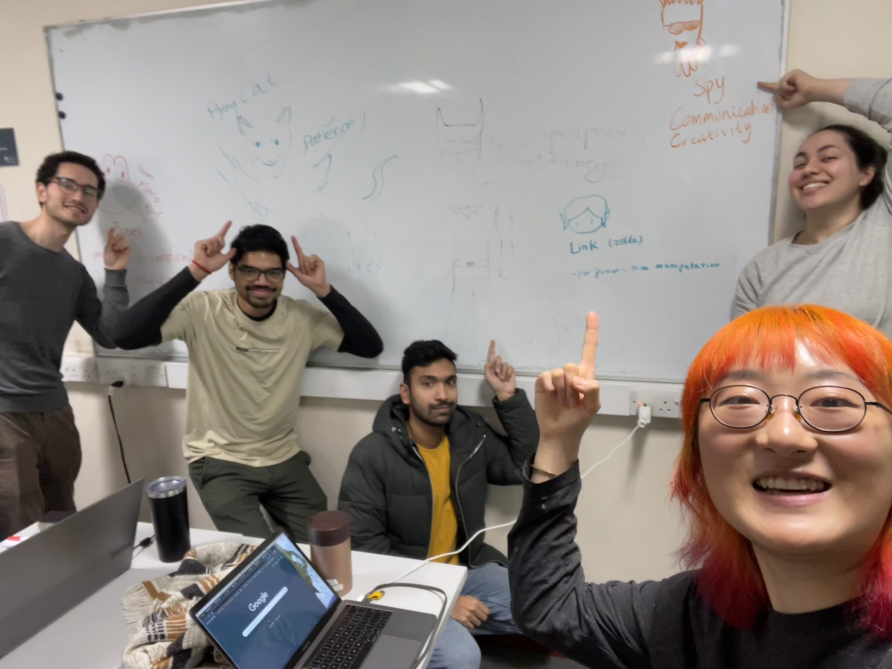
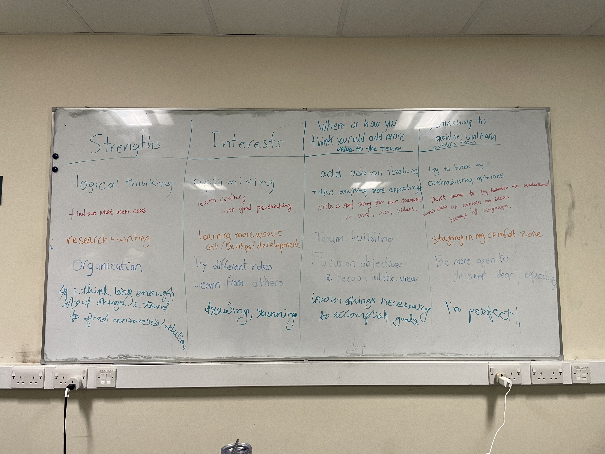
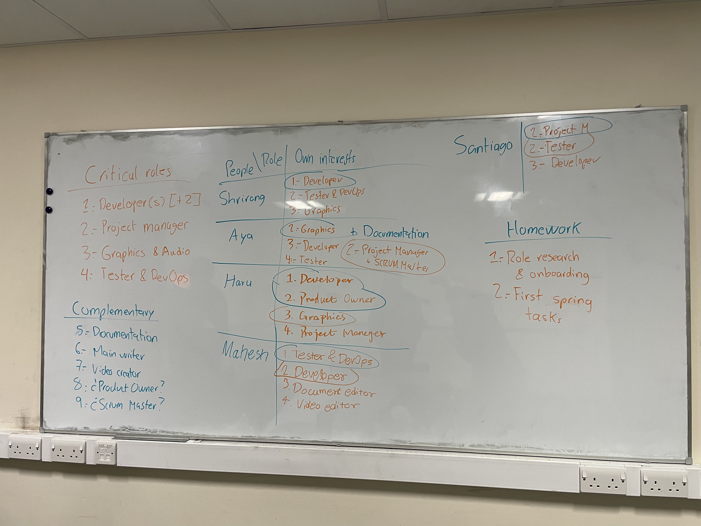
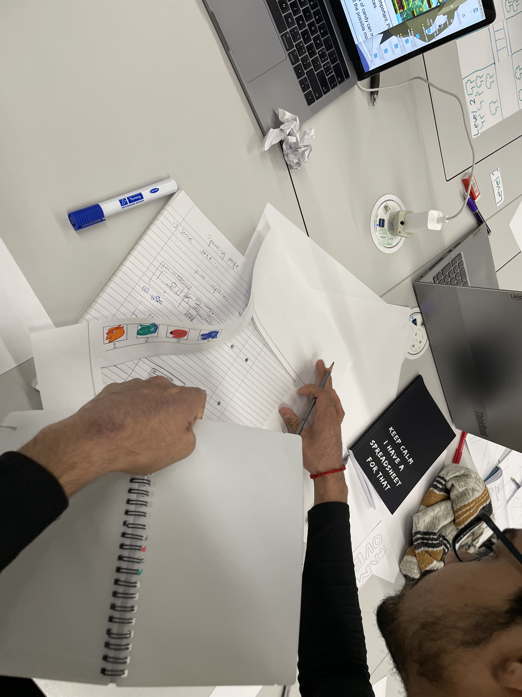

## 2025 Week3 Meeting 4

## 1. Meeting Information
- **Date**: 2025-01-28
- **Time**: 12:00
- **Location**: [Chemistry Library Group Room 2]
- **Participants**: Haru, Shrirang, Mahesh, Aya, Santiago

---

## 2. Agenda
1. Share our favorite game characters and desired superpowers.
2. Discuss individual strengths, interests, potential contributions, and areas to avoid.
3. Assign roles for the project, balancing key and complementary roles.
4. Address Aya's question about project grading criteria.
5. Highlight the importance of storytelling in both the game and documentation.
6. Conduct paper prototype testing during the workshop.

---

## 3. Discussion Details

### Topic 1: Sharing Personal Preferences
- **Key Points Discussed**:
  1. Each team member shared our favorite game character and the superpower they wish to have.
  2. Discussed personal **strengths, interests, contributions, and avoid**:

     - Strengths: Skills or expertise members feel confident in.
     - Interests: Roles or areas we are excited to explore.
     - Contributions: How we can add extra value to the project.
     - Avoid: Things we try not to do.

---

### Topic 2: Assigning Project Roles

- **Key Points Discussed**:
  - Established two types of roles:
    1. **Critical Roles**:
       - Developer(s) [2+]
       - Project Manager
       - Graphics & Audio
       - Tester & DevOps
    2. **Complementary Roles**:
       - Documentation
       - Main Writer
       - Video Creator
       - Product Owner
       - Scrum Master
  - Each member selected our desired roles, following the principle of pairing experienced members with those who want to learn.
  - Shift roles every 4 weeks.
  - **Role Assignments (based on the whiteboard)**:
    - Shrirang: Developer, Tester & DevOps, Graphics
    - Aya: Graphics, Developer, Tester
    - Haru: Developer, Product Owner, Graphics, Project Manager
    - Mahesh: Tester & DevOps, Developer, Documentation, Video Editor
    - Santiago: Project Manager, Tester, Developer
  - **First round of role**:
    - Shrirang: Developer
    - Aya: Graphics, Documentary
    - Haru: Developer, Product Owner
    - Mahesh: Tester & DevOps
    - Santiago: Project Manager
---

### Topic 3: Addressing Aya's Question
- **Question**:
  - “How to make that decision and how that would impact our grade on the project. I was concerned that we would not make the best possible game if we were trying to learn new skills along the way, which would possibly lower our grade?”
- **Answer from the Professor**:
  - "They focus on the process when grading, not the outcome, and want to see how we were thinking and developing ourselves as a team. He seemed really excited and happy and said that its great that we are even thinking this way and that if we wrote about this process of choosing roles and how the outcome was in our report, this could actually boost our grades."
- **Summary**:
  - The professor emphasized that the grading focuses on **the process** rather than just the outcome. They are looking for how the team works together, thinks critically, and grows through the project.
  - Highlighted that documenting the **role selection process** and its outcomes could positively impact the grade.

---

### Topic 4: Importance of Storytelling
- Proposed to prioritize storytelling after completing the main development tasks:
  - Develop a compelling story for both the game and the documentation.
  - Ensure the report reflects the team's thought process, growth, and challenges.

---

### Topic 5: Workshop Activities

- Conducted **paper prototype testing**:
  - Shared the prototype with other teams and gathered feedback.
  - Reviewed prototypes from other teams for inspiration and improvement ideas.

---

## 4. Action Items
1. **First Sprint Tasks**:
   - Refer to the course material: [First Sprint Tasks](https://uob.sharepoint.com/:p:/t/UnitTeams-COMSM0166-2024-25-TB-2-A-newstaffroom/EQC2UGq7-WNLu5gqOkJV7TEBDfHY9t0In9L3yPRT5_kqWg?e=Q8e8Ns&nav=eyJzSWQiOjMxOSwiY0lkIjoyMjY2MjQ0OTkzfQ).
2. **Create a Single Document**:
   - Document all team roles during the Sprint, including responsibilities.
3. **Workshop Homework**:
   - Finalize the game idea: Write a one-paragraph description of the game concept.
   - Include paper prototype images or videos.

---

## 5. Next Meeting
- **Date**: 2025-01-28
- **Time**: 12:00
- **Location**: [Arts and Social Sciences Library(first floor) Group Study Room 3]
- **Proposed Agenda**:
  1. Review First Sprint progress.
  2. Refine game idea and features.
  3. Plan next steps for development and documentation.
