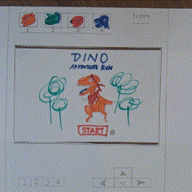
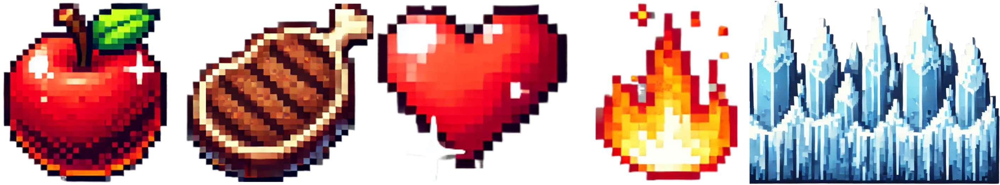

  

# Dino Escape: An Extinction Adventure Game

## ★ [Try the game](https://uob-comsm0166.github.io/2025-group-13/)
  
## ★ [Check the code](/docs)

## ★ [Watch demo video](https://youtu.be/gaBLE-WW40c?feature=shared)

# Table of Contents
1. [Team](https://github.com/UoB-COMSM0166/2025-group-13?tab=readme-ov-file#team)
2. [Introduction](https://github.com/UoB-COMSM0166/2025-group-13?tab=readme-ov-file#introduction)
3. [Requirements](https://github.com/UoB-COMSM0166/2025-group-13?tab=readme-ov-file#requirements)
4. [Design](https://github.com/UoB-COMSM0166/2025-group-13?tab=readme-ov-file#design)
5. [Implementation](https://github.com/UoB-COMSM0166/2025-group-13?tab=readme-ov-file#implementation)
6. [Evaluation](https://github.com/UoB-COMSM0166/2025-group-13?tab=readme-ov-file#evaluation)
7. [Process](https://github.com/UoB-COMSM0166/2025-group-13?tab=readme-ov-file#process)
8. [Sustainability, Accessibility, and Ethics](#sustainability-accessibility-ethics)
9. [Conclusion](https://github.com/UoB-COMSM0166/2025-group-13?tab=readme-ov-file#conclusion)

# Team

  
 <i><strong>Figure 1</strong>: First Sprint Planning session</i>

<table align="center", style="border-collapse: collapse; text-align: center;">
 <thead>
    <tr>
     <th>Name</th>
     <th>Email</th>
     <th>GitHub Username</th>
     <th>Main Role</th>
    </tr>
 </thead>
 <tbody>
   <tr>
    <td>Ran Tian</td>
    <td>jy24630@bristol.ac.uk</td>
    <td>HaruTian4604</td>
    <td>Graphics & Design</td>
   </tr>
   <tr>
    <td>Shrirang Lokhande</td>
    <td>ju24635@bristol.ac.uk</td>
    <td>ShrirangL</td>
    <td>Software Developer</td>
   </tr>
   <tr>
    <td>Mahesh Nanavare</td>
    <td>aw24545@bristol.ac.uk</td>
    <td>MaheshNanavare</td>
    <td>Software Developer</td>
   </tr>
   <tr>
    <td>Aya Saneh</td>
    <td>vg24625@bristol.ac.uk</td>
    <td>aya-codes</td>
    <td>Project Manager</td>
   </tr>
   <tr>
    <td>Santiago Muriel</td>
    <td>ld24352@bristol.ac.uk</td>
    <td>smurielv</td>
    <td>Software Developer</td>
   </tr>
</table>

<strong>Figure 2</strong>: Team information

# Introduction

 
  
 <i><strong>Figure 3</strong>: Level 1 gameplay</i>

Dino Escape is an action-packed retro platformer inspired by classic Mario Bros gameplay, but with a prehistoric twist as well as a different gameplay experience. Step into the escape of the last T-Rex, racing against extinction through challenging levels and vibrant landscapes. 

Though our game is inspired by classic platformer games, the health bar provides a slightly different experience. Firstly, users will need to pay attention to the environment and look for food, which will increase their health, and avoid dangerous elements, which will rapidly decrease it. Secondly, due to the harsh landscape that threatens the player, health will continuously run out. This adds a time element, pushing users to feel that constant threat of extinction. 

 
  
 <i><strong>Figure 4</strong>: Level 2 gameplay</i>

The extinction theme is present throughout the game: in the first part, a volcano has erupted and lava is everywhere – jump on the platforms to escape death. In the second part, your world has frozen over, and every moment you stay outside threatens your existence. While the first part is relatively easy and achievable for gamers of any skill level, the second part is far more challenging, and it has a way of keeping even experienced gamers engaged. 

The game makes use of classic keyboard controls to ease the learning curve, as well as introducing responsive development through the novelty of a mobile version. Developed primarily using p5.js, with additional flair from HTML and CSS, Dino Escape merges nostalgic gaming experience and style with modern web technologies to deliver a uniquely engaging adventure. 

# Requirements 

This section will cover a few of the key considerations in the early stages of our game development’s life cycle: ideation, feasibility, stakeholders, use cases, epics, and user stories. 

## Ideation & early stage design
The ideation process for our game began with research and brainstorming. We then compiled an initial list of 13 proposals. We evaluated each option using the following criteria: Attractiveness, Complexity, Feasibility using p5.js, and User-Friendliness.

  
 <i><strong>Figure 5</strong>: Initial game ideas</i>

From there, we ranked our choices, discussed the ones that scored the best, and chose two very different games to validate through paper prototypes: ‘Dino Escape’ and ‘Train of Thought’.

  
 <i><strong>Figure 6</strong>: Game ideas ranking</i>

Based on the feedback we received, we settled on ‘Dino Escape’, which was more intriguing to users and had much more potential for expansion.

  
 <i><strong>Figure 7</strong>: Paper prototype of the game</i>

We did some feasibility studies to get us started on programming in this new language, to get more feedback about the game mechanics, and  to make sure we were still excited about ‘Dino Escape’. We developed our first digital prototype: 

 
  
 <i align="left"><strong>Figure 8</strong>: 1st digital prototype of the game</i>
 <i align="right"><strong>Figure 9</strong>: 2nd digital prototype of the game</i>

## Stakeholders

  
 <i><strong>Figure 10</strong>: Onion Diagram segregating Stakeholders</i>

As we filled in the Onion diagram, we realised that this game will have an impact beyond the deadline for the report. Just as we looked to previous students’ work for inspiration, future students will look to ours. In the future, our game’s impact could expand to new stakeholders, including product owners, financial advisors, and marketing and SEO experts in the inner circle alone. 

The article “Stakeholders Without Tears: Understanding Project Sociology by Modeling Stakeholders” by Ian Alexander and Suzanne Robertson helped us understand the impact of our own role changes within the group. For us, changing roles created a more balanced sense of shared ownership of our product. 

## Use Cases

  

 <i><strong>Figure 11</strong>: Use Case Diagram</i>

**- Use Case Name:** Play </li>

**- Description:** The player utilizes controls to navigate and tries to win the game.

**- Basic Flow:**

1. The Player uses input devices (Computer or Mobile or Tablet) to start the game.

2. Player reads Instructions and presses the jump key to play the game.

3. The Player moves their character within the Jurassic environment.

4. The health of the player gets increased/decreased based on the interaction between player and other entities in the game.

5. After reaching the cave at the end of the level, level gets completed.

6. After completing all the levels, player wins.

**- Alternative Flows:**

1. Game pauses after pressing the Escape key. After pressing the jump key, the game resumes.

2. After reaching zero health, the player dies. The Game Over screen gets displayed with options to go back to home and to retry the level again.

## Epics and User Stories

  
 <i><strong>Figure 12</strong>: Kanban Board</i>

Here are a few of the user stories that shaped our game development: 
1. As a **DevOps engineer**, I want to configure branch protection rules for the main branch, so that I can prevent accidental force pushes and deletions.

2. As a **casual gamer**, I want to control the character using right, left, and up keys, so that navigation is intuitive and the learning curve is smaller.

3. As a **gaming enthusiast**, I want the interactions between objects in the game to be realistic, so I can have an enjoyable experience.

4. As an **amateur user**, I need clear instructions on how to move the character and which elements to focus on, so that I can spend less time figuring out how to play.

5. As a **user with a busy schedule**, I want to be able to pause and resume the game, so that I am able to play in short bursts and my progress is not lost.

6. As an **avid reader and movie watcher**, I want to see elements of the story as I am playing, so that I feel engaged and excited to complete the game.

7. As a **user who does not own a PC**, I want to be able to play the game from my phone, so that I can experience this game without needing to borrow a computer.

8. As **someone with knowledge about dinosaurs**, I want the extinction theme to be grounded in scientific facts, so that I feel the developers respected the subject matter.

9. As a **lover of art**, I want the visual aspect of this game to be pleasing, so that it can be enjoyable to play.

10. As a **player of several platformer games**, I want this game to have an interesting twist, so that I can experience both familiarity and variety. 

11. As an **environmentally-conscious gamer**, I want access to information about the game's sustainability considerations, so that I feel morally and ethically at peace while playing.

12. As a **Scrum Master**, I want the developers to delete unused code, so that the system has a minimal environmental footprint.

According to “The Use and Effectiveness of User Stories in Practice” by Garm Lucassen and others, their study of user stories found that the “why” in a user story is necessary (Lucassen et al., 2016). We found that searching for that reason leads us to prioritise that user story, instead of seeing it as just another task to complete. 

# Design

## System Architecture and Class Design

  <table style="border-collapse: collapse; text-align: center; width: 60%; margin: 0 auto;">
    <tr>
      <th>Category</th>
      <th>Image</th>
      <th>Description</th>
    </tr>
    <tr>
      <td>Dino</td>
      <td></td>
      <td>The main and only playable character, a red dinosaur.</td>
    </tr>
    <tr>
      <td>Platform</td>
      <td></td>
      <td>Simple brick tiles are combined to create ground and platforms.</td>
    </tr>
    <tr>
      <td>Cave</td>
      <td></td>
      <td>It symbolises safety and is the victory condition for each level.</td>
    </tr>
    <tr>
      <td>Trap</td>
      <td></td>
      <td>Deadly danger if the player falls into these cracks in the ground.</td>
    </tr>
       <tr>
      <td>Enemy</td>
      <td></td>
      <td>Enemies move on platforms and damage the player.</td>
    </tr>
    </tr>
       <tr>
      <td>Falling item</td>
      <td></td>
      <td>Randomly dropped damage from the air.</td>
    </tr>
    </tr>
       <tr>
      <td>Health Item</td>
      <td></td>
      <td>Including foods and ground obstacles that have an effect on player health</td>
    </tr>
  </table>

 <i><strong>Figure 13</strong>: Game objects</i>

The **Game** is at the core of the program. It keeps track of the current level, updates the game each frame, draws everything on screen, and handles communication between classes. 

The **AssetManager** is in charge of loading all images and sounds, so everything stays efficient and centralized. 

The **Brick** defines constants like tile size to keep things consistent, especially for platforms and UI elements.

The **InputHandler** turns key or screen-touches into high-level commands like moving, jumping, or pausing, and passes them to the Game class. This encapsulates user input instead of having it detected and handled by every class, which is what we had at first. 

The **Map** includes all the objects for the current level from the following classes: Platform, Enemy, Food, GroundDamage (fire or ice), Skyfall, and Cave. The Map creates and updates these objects, draws them to the screen, and manages any movement they have.

The **Player** represents the character controlled by the user. It tracks things like position, speed, and size, and responds to gravity, movement, and collisions. 

The **Health** manages a player’s health, which drops when hitting enemies or hazards but can be refilled with food. The Health class keeps track of the health percentage and displays it as a bar. 

The **GameScreen** takes care of what is outside the main gameplay, like the home screen, pause menu, or game over screen. 

## Class Diagram

  
 <i><strong>Figure 14</strong>: Class Diagram</i>

The figure above shows the interaction of all the classes with each other. 

- sketch.js is provided as a starting point by p5.js. The draw() method in sketch.js gets called in loop by p5.js. This method changes game state based on user interaction and calls static game methods handleInput(), update() and draw(). sketch.js also initializes the InputHandler, GameScreen, and Game objects. 

- InputHandler samples and stores user input. 

- GameScreen draws the different screens according to the game state. Game draws the screen when the user is actually playing the game, all other screens are drawn by GameScreen. 

- Game contains everything visible to the user during gameplay. Game owns the Player, its Health and Map. 

- Player is composed of Health and navigates through all the other game entities. 

- Map is composed of other game elements like Enemies, Foods, Cave, GroundDamage and SkyFall objects, and Platforms. 

- AssetManager is used by all classes except InputHandler for graphic and audio resources. 

- Brick gives the Health and Platform classes their dimensions.

## Sequence and Behaviour

  
 <i><strong>Figure 15</strong>: Behavioural Diagram</i>

The core game logic in Dino Escape is driven by an update loop managed by the Game class, which processes player inputs, updates all game objects, and manages game states. 

Player actions (movements) are detected by the InputHandler, which translates these inputs into commands passed to the Game. The Game then updates the player, enemies, platforms, and other elements within the Map, checking for collisions with enemies, food, or traps. 

The Health is adjusted accordingly, with decreases upon hitting obstacles and increases from collecting food. 

If the player’s health drops to zero, the game transitions to a “game over” state, while reaching the cave triggers a “level complete” state.

## Visual Style and Sound

### Graphics
At first, we found a set of beautiful dinosaur GIFs and designed our game’s visuals around them, creating a lush forest theme. But as we added more elements, it became harder to create visuals that matched that style. Also, the GIFs were large in file size, which could slow down the game.

After some discussion, we decided to switch to a pixel art style. This made it easier to maintain a consistent look and design new levels and characters. We received a lot of positive feedback about this style during the Testathon, with many describing it as “retro” and “nostalgic”.

### Performance
While designing, we didn't just focus on visuals — we also cared about performance and sustainability. We avoided large GIFs and switched to smaller images or creating animations directly in p5.js. We also used a Texture Atlas, which combines many small images into one composite image. We used Sprite Sheet Animation for the dinosaur’s movement, which saved space and kept the animations smooth.

These design choices helped us achieve a more sustainable game, with faster load times and lower performance demands on players' devices.

### Sound
Sound in video games is not just an addition but an essential element that actively shapes player interaction (Collins, 2013). We designed sound effects for every stage of the game and for different player states. This combination of sound and visuals provides instant feedback to players and enhances their sense of immersion.

**Overall**, the system is designed to be modular and well-encapsulated. The Game class ties everything together, while assets, input, and gameplay logic are handled by their own parts. This makes the code easier to expand, test, and maintain in the future.

# Implementation

This section will describe a few key stages in the development of our game, including the two main challenges we faced: mechanics/collision detection and responsive design. 

## Early Development
Development began with a minimum viable product (MVP) that laid the foundation for our 2D platformer. The MVP introduced two core functionalities essential to future iterations:

- **Persistent Rectangular Entities:** Rectangles represented key game elements—like the player and enemies—whose positions remained consistent across frames. This provided a stable interaction model.

- **Player Movement via Arrow Keys:** The player could move a rectangle using the keyboard’s arrow keys. Movement was linear and unaffected by gravity or momentum, offering a static, grid-like layout.
  
This prototype served as the sandbox where we validated our control system and logic before layering in additional mechanics.

## Challenge 1: Game Mechanics and Collision Detection
To evolve the experience from a static environment into a true platformer, we introduced two key features: **gravity simulation** and **collision detection**.

We simulated gravity by incrementally increasing the player’s vertical velocity each frame. This created a realistic free-fall effect while keeping horizontal movement unaffected.

Gravity introduced the need for a **robust collision detection system**. We began with **bounding box collision**, defining a collision when the horizontal and vertical spans of two rectangles intersected. This covered two critical cases:

- **Standing on Platforms:** When landing, the player’s bottom edge had to align with the top of a platform. We reset vertical velocity and adjusted the player’s Y-position to simulate standing still.

- **Horizontal Collisions (Walls):** For collisions with vertical surfaces, we corrected vertical positioning first, followed by horizontal adjustment to prevent wall penetration.

However, these basic rules weren’t enough. Players sometimes reset to unnatural positions after collisions. We needed a generalised solution. Our refined approach analysed the overlap area in a collision. Later we changed the collision detection logic to depend on the player's direction of motion instead. This significantly improved consistency, and overall smoothness of the motion.

## Overcoming Challenge 1
**Visual Representation and Platform Interaction:**

With collision mechanics stabilized, we enhanced the game's visuals. Basic rectangles were replaced with **sprites and textures**, transforming the abstract forms into recognizable elements:

- Platforms were changed to stone blocks or grassy terrain.

- The player took on a humanoid or animated character form.

These visual improvements didn’t change mechanics but significantly improved user perception and game immersion.

**Camera Motion and Dynamic Environment:**

As our levels grew larger than a single screen, we implemented a **camera system** to simulate world traversal: 

- The camera stayed static until the player crossed a horizontal threshold.

- After that, the world scrolled in the opposite direction of the player’s movement, creating the illusion of exploration.

We adopted **one-way camera constraints** inspired by *Super Mario Bros*.. Players could not backtrack past the starting point. The camera began scrolling once the player passed the midpoint of the screen. If the destination was already visible, full movement was permitted across the screen.

**Scalable Level Design and Layout Management:**

  
 <i><strong>Figure 16</strong>: Hand-Drawn Level Maps</i>

Initially, platform and NPC positions were hardcoded into the Map class, making the code brittle and unscalable. To overcome this, we introduced a Layout class, which:

1. Encapsulated position data for all entities across all levels.

2. Loaded layout data into the Map class at runtime, especially during level transitions.

3. Allowed new levels to be added without modifying core logic or duplicating code.

This modular approach supported **persistent game states**. Platforms and NPCs could be reloaded on pause or reset, ensuring continuity. Layouts were loaded only when needed, so performance remained unaffected—even as the number of levels grew significantly.

## Challenge 2: Enabling a Mobile Version
After the **Testathon**, we focused on making the game playable on mobile devices. This required addressing three major issues:

**Input Method Changes:**

The original game used **keyboard input** (arrow keys, spacebar). To support mobile, we built a **centralized controller class** capable of processing input from multiple sources—keyboard, mouse, and touch. We also added on-screen **touchable buttons**, activated only when touch capabilities were detected.

**Responsive Design and Layout:**

Our original layout was optimized for desktops. We faced challenges in **extracting device characteristics** and adapting visuals accordingly. We applied a combination of HTML, CSS, and p5.js to detect screen size and dynamically adjust canvas and UI elements, ensuring optimal display on any device.

**Testing Across Devices:**

Finally, as mentioned in the Testing section, we conducted continuous testing using browser developer tools and real devices, discovering bugs, solving issues and ensuring compatibility.

Overall, through iterative development, careful modularization, and responsive design, we successfully transformed a basic prototype into a scalable, cross-platform 2D platformer.

# Evaluation

This section is about how we evaluated and tested our game at different stages in its development. User testing and feedback informed the progression of our game. This focuses on formal settings and evaluations, but a lot of informal evaluations were done with friends and family throughout. 

## Testathon and Lab Evaluations

To evaluate our game, we conducted qualitative evaluations using Think Aloud, Heuristic, and user interviews, as well as quantitative evaluations using the System Usability Scale and NASA Task Load Index. We used the qualitative evaluations to guide our development of new features and fine-tuning of existing features. 

  
 <i><strong>Figure 17</strong>: Team at the Testathon Event</i>

On February 25th and March 4th, our classmates evaluated our game during the lab. However, we wanted more feedback and a larger sample, so we also attended the testathon on March 5th. In preparation, we created a consent form that participants could fill, containing options such as consent to be photographed or recorded while playing or giving feedback. We also had a participant information sheet that explains our game and why we are collecting feedback and taking photos and videos. 

## Qualitative Evaluation

At the testathon, we were able to receive feedback from a wide variety of players, including many who are experienced in game development. As such, we received rich and helpful qualitative feedback there. Though we did perform several Think Aloud and Heuristic evaluations, most of the feedback was given in the form of interviews with a few simple prompting questions. We prepared these questions ahead of time as a team with a focus on avoiding leading questions. Some examples of the questions are “What did you think about the visuals and graphic design?”, “What do you think the game is about?”, and “What do you imagine for the next level?”. 

The responses were analysed as follows: first, statements were categorised based on whether they were highlighting an issue or something the tester liked. Then, focusing on the issues, these were categorised further depending on which aspect of the game was concerned. Then, we counted the number of times that type of issue was mentioned. The results are included in the following figure:

  
 <i><strong>Figure 18</strong>: Qualitative Evaluation</i>

After the testathon, two members of our team dedicated several weeks to resolving these issues, and they were able to resolve all of the issues, though they decided to postpone creating more levels. 

## Quantitative Evaluation
As for the quantitative evaluation, we developed a Google form for each of the two surveying methods we learned: the System Usability Scale (SUS) and NASA Task Load Index (TLX). We collected a large number of responses for both: 47 for the SUS and 32 for the TLX. The results we got for the SUS indicated that there was no significant difference between the levels in terms of usability. We scored above average for both levels, as shown in the following figure:

  
 <i><strong>Figure 19</strong>: SUS Results</i>

On the other hand, there was a definite difference for the two levels we tested in terms of task load. Based on the evaluations of eleven participants who completed the two levels in different orders, we had a W test statistic of 2, where less than 10 would indicate a statistically significant difference. 

The task load scores for levels one and two indicate that level two was significantly more challenging than level one, which is in line with our aim for the two levels. The specific results are as follows:

  
 <i><strong>Figure 20</strong>: NASA TLX Average Scores</i>

  
 <i><strong>Figure 21</strong>: NASA TLX Scores by Demand Category</i>

## Testing
For our p5.js game, we manually tested feature branches by playing in the browser to ensure new features worked and didn't break existing ones. Playtesting focused on gameplay, user experience, and performance. We documented feedback in GitHub milestones and issues for each pull request. We experimented with automated testing using GitHub Actions, but the overhead seemed disproportionate for our lightweight project, making manual testing more efficient. Our approach was primarily black-box, focusing on the player experience, though we occasionally used white-box principles for debugging. This combination of playtesting and documented feedback in GitHub facilitated iterative improvements before merging.

While developing the mobile version, we conducted continuous testing using browser developer tools and a variety of phones. Initially, only the newest devices and certain browsers could load and run the game. Through continuous real-device testing, we debugged performance issues and ensured compatibility across platforms.

# Process 

This section describes the process that helped us develop our game. This is like the Sprint Retrospective of our report: it is focused on how we worked as a team, not what we achieved. 

## Meetings
As a team, we met frequently and always in person. We made use of spaces with screens or whiteboards, which we used to express and discuss our ideas. For our first few meetings, we focused on getting to know each other better, to create an atmosphere where everyone felt comfortable and part of the team. For example, during one of our first meetings, everyone drew a picture of their country of origin, trying to locate their hometown, and told us about their culture and history. 

  
 <i><strong>Figure 22</strong>: Team's Icebreaker Activity</i>

Later, our meetings varied in content and focus, but overall we stuck to an Agile mindset and Scrum methodology and workflow. We had four sprints of one or two weeks each during which we tried to develop our game efficiently, focusing on a specific goal each time. Afterwards, we would meet to do a Sprint Review focused on what we had done, Sprint Retrospective focused on how we had worked together, and Sprint Plan for the next sprint. 

## Team profiling

One of our first meetings after getting comfortable with each other was a team profiling session. We spent time listening and understanding each other's experiences, interests, and strengths.

  
 <i><strong>Figure 23</strong>: Team profiling activity</i>

We defined the necessary roles for our project, differentiating between critical roles, which would be needed throughout the project, and complementary roles, which would be needed for a specific period of time. 

  
 <i><strong>Figure 24</strong>: Role Assignment and Rotation</i>

We had a lengthy discussion about whether we should each work in the role we are most skilled at, or whether to explore our interests, and even discussed this with our professors. We decided it would be best to balance both, giving each other opportunities to explore new things by shuffling the roles after the second sprint. This gave each person the ability to experience something new, as well as work in a role they had experience in. At one point, someone felt that they wanted to change roles, and several team members shifted roles to make that happen. In the end, we each did some game development as well as at least one other role. 

## Choosing our tools
Though we had great communication in person and found it easy to work together, it was harder to continue working when we were apart. We needed well-defined, simple ways to communicate. We used both Microsoft Teams and Whatsapp for communication, depending on the type of message. For coding, we used Visual Studio Code as our IDE and GitHub for collaboration and version control. Google Drive helped us organise and share our documents and Powerpoint was useful for creating simple diagrams and visual aids. 

**For communication:**

 - Whatsapp: to keep in touch, ask quick questions, and schedule meetings.
 - Microsoft Teams: to centralise communication (discussion, reviews, etc.) and enable asynchronous work.

**For coding and writing:**

 - Visual Studio Code: as our IDE for software development.
 - Google Drive: to write and edit the report, collect pictures and videos, and manage all our documentation and notes (weekly tasks, documents, spreadsheets, pdfs, etc.).
 - GitHub: to host the central repository of the project, including all the game code, but also to achieve other interesting things.
   * GitHub Projects: to manage the Kanban board.
   * GitHub Actions: to automate the deployment of our code.
   * GitHub Pages: to host and allow to play our game online.

**For designing and editing graphics and visual aids:**

 - PlantUML: for generating our Behavioural and Class Diagrams.
 - Microsoft Powerpoint: for putting together images and making small edits on them, as well as creating diagrams for this report.

## Adjusting along the way
Regarding the implementation of Agile and Scrum, our first sprint was one week long. It was used to test the methodology and p5 language and attempt to create a first prototype of our game. We decided to have stand-up meetings four days a week to discuss any issues we were facing. Up till that point, we had been using just Whatsapp for communication outside meetings, and we hoped the stand-ups would ease communication and stress. 

After that sprint, we met for our first Sprint Review and Retrospective, and it was clear that a week-long sprint was too short and that the stand-ups were not working for us. We decided that all future sprints would last two weeks, and that we would have longer meetings twice a week. Later, we added Microsoft Teams to create a second space for communication, which created a clearer boundary between work and personal life, and we all committed to checking Teams regularly.
 
According to Martin Fowler, the essence of Agile is to be “adaptive” and “people-oriented” (Fowler, 2019). By adopting new tools when needed and choosing and changing roles for each other’s benefit, we were able to implement the core principles of Agile during this project. 

# Sustainability, Accessibility, and Ethics
This section outlines the key sustainability aspects we addressed in the development of our game, focusing on environmental, technical, and individual impacts.

## Environmental Sustainability
Based on the Green Software Patterns, we implemented several improvements to reduce energy consumption and enhance efficiency:

- [Keep request counts low](https://patterns.greensoftware.foundation/catalog/web/keep-request-counts-low/) and [minimize main thread work](https://patterns.greensoftware.foundation/catalog/web/minimize-main-thread-work/): During the development of the central input handler, we identified redundant function calls across multiple classes. By consolidating these into a single controller running once per frame, we significantly reduced JavaScript request frequency and workload on the main thread—contributing to a more energy-efficient runtime.
  
- [Minify web assets](https://patterns.greensoftware.foundation/catalog/web/minify-web-assets/) and [optimize image size:](https://patterns.greensoftware.foundation/catalog/web/properly-sized-images/) We have applied several optimizations like combined multiple images into sprites to reduce HTTP requests, compressed large image files, replaced heavy GIFs (3MB) with lightweight sprite animations (300KB) and produced smaller audio assets (MP4) that loop efficiently.
  
- [Remove unused CSS definitions:](https://patterns.greensoftware.foundation/catalog/web/remove-unused-css/) After the early development sprints, we checked our CSS files and removed unused definitions, trimming unnecessary code and improving page load performance.

In the future, we can work towards [defer offscreen images](https://patterns.greensoftware.foundation/catalog/web/defer-offscreen-images) and [deprecate GIFs](https://patterns.greensoftware.foundation/catalog/web/deprecate-gifs/) for animated content patterns.

 
  
 <i><strong>Figure 25</strong>: Composite images of multiples game assets</i>

  
 <i><strong>Figure 26</strong>: Group of users playing our game</i>

## Technical Sustainability

According to the Sustainability Assessment Framework (SusAF), Technical Sustainability comprises five aspects: 

- Maintainability: our game is currently hosted by GitHub Pages, and we have mostly tested it in mainstream browsers. If these platforms were updated, we would need to test and update our game. Continuous testing and maintenance are crucial to our game’s operation.

- Usability: our game has simple controls and clear instructions. We increased the graphics’ contrast for easier detection of objects and made the dinosaur flash red when injured. The adaptability to different devices makes it usable to a wider range of abilities. 

- Adaptability: the game can be used on a PC or touch-screen device and is continuously being tested on more devices.

- Security: the game does not collect or store any information, and so is not desirable for hackers. Also, all our code is available to the public through GitHub, so that is not a reason to attack either. 

- Scalability: our game can currently be played on multiple devices at once, but we have not tested this on a large-enough scale that we know if there are limits to this capacity. 

## Individual Sustainability

As for Individual Sustainability, it is made up of the following:

- Health: we noticed that some users were displaying addictive behaviours, like repeating the second level many times consecutively because they kept losing. Accordingly, we decreased the health depletion rate slightly to make it possible to complete for a larger proportion of players. This increased the sense of achievement and decreased feelings of frustration and high mental and temporal demand. 

- Lifelong learning: the first level has some challenges but is easier to complete, encouraging amateur gamers to try and learn how to play. The second level is significantly more difficult but still doable, and encouragement to try again is built-in. If a player loses during a certain level, the game will restart from that level, encouraging gamers of any ability to try again. 

- Privacy: since the game collects no information about its players, not even a name, users can trust that their privacy is respected and preserved. 

- Safety: because we are not collecting any personal information, users can feel safe and know that this game does not expose them to any danger or risk. 

- Agency: at any point during gameplay, users are free to pause and resume the game. Also, between levels, players have the choice to continue to the next level or return to the home screen. Also, if users have any issue or complaint, our contact information is available in the readme file in our repository. 

While our current focus has been on environmental, technical and individual sustainability, we recognize the importance of economic and social issues as well. In future iterations, we aim to explore ways to reduce long-term hosting costs, foster a more inclusive community around the game, and continue to minimize the environmental impact. These aspects are just as vital and will guide our next steps toward a more holistic sustainable approach.

We’ve taken some first steps to make our game more sustainable, ethical, and accessible—like optimizing energy use, simplifying controls and supporting different devices. Still, there’s plenty of room to grow. For the future of the game, we would like to keep improving in these areas, because we believe they’re essential to creating thoughtful and responsible software.

# Conclusion
Though teamwork can often be a challenging experience, working on this team was rewarding for all of us. From our initial brainstorming to the final tweaks, every stage of this project taught us valuable lessons in software engineering and teamwork. This project allowed us to apply the unit’s materials, leading to deeper knowledge of the ideas and a lived experience of their implementation.

One thing we did very well was connect as a team. We had a great deal of trust between us, and our regular meetings helped to establish and maintain that strong team spirit. Integrating our branches and version control were significant challenges for our first few sprints. With time, we were able to improve our development process by adopting a set of code standards, like using name conventions, defining how to document code, and implementing a code review system.

Realising the environmental impact of digital storage and energy use encouraged us to adopt more sustainable coding practices. We actively worked to refactor our code, making the game playable on mobile devices. This made the game accessible to mobile users while also making choices that are more sustainable technically and environmentally.

Along the way, we often re-evaluated our roles to make sure work was distributed fairly, and Sprint Retrospectives were a great opportunity to do so. We learned the importance of putting the user at the center of the design process. Iteratively developing prototypes, gathering feedback, and refining our ideas helped us create a more fun and engaging experience for players.

We have overcome our two big challenges, but given enough time we could do so much more. Enhancing accessibility by offering non-tactile ways to play or adding support for screen readers would help make the game more inclusive. We would also improve the user experience by creating a full-screen mode and optimizing the performance to run smoothly on any device. Expanding the game with more levels, a bigger range of enemies, and a more developed storyline would make the experience even more immersive. Additionally, we would revisit our original idea of having multiple playable dinosaurs with different powers that a user can switch between.

As for our development process, future iterations could benefit from a stronger focus on Agile practices. Specifically, we would spend more time pair programming, implement test-driven development, and automate testing and deployment. We would also explore game engines and frameworks beyond p5.js to unlock more features and boost performance. Also, we would like to develop a full application with multiplayer mode, allowing users to play online together and create herds of dinosaurs that overcome extinction.

All in all, we feel lucky to have been part of such a strong and supportive team. This project helped us grow—not just in terms of technical skills, but also in how we work with others and approach problems. 

# Contribution Statement
<table align="center", style="border-collapse: collapse; text-align: center;">
 <thead>
    <tr>
     <th>Team Member</th>
     <th>Contribution</th>
    </tr>
 </thead>
 <tbody>
   <tr>
    <td>Ran Tian</td>
    <td>20</td>
   </tr>
   <tr>
    <td>Shrirang Lokhande</td>
    <td>20</td>
   </tr>
   <tr>
    <td>Mahesh Nanavare</td>
    <td>20</td>
   </tr>
   <tr>
    <td>Aya Saneh</td>
    <td>20</td>
   </tr>
   <tr>
    <td>Santiago Muriel</td>
    <td>20</td>
   </tr>
</table>

<strong>Figure 27</strong>: Team contribution statement

# References
1. Alexander, I. and Robertson, S. (no date) Stakeholders without Tears: Understanding Project Sociology by Modeling Stakeholders. Available at: https://www.scenarioplus.org.uk/papers/stakeholders_without_tears/stakeholders_without_tears.htm (Accessed: 15 April 2025).
2. Collins, K. (2013) Playing with Sound: A Theory of Interacting with Sound and Music in Video Games. Cambridge, MA: MIT Press.
3. Fowler, M. (2019). Agile software guide. [online] martinfowler.com. Available at: https://martinfowler.com/agile.html.
4. Lucassen, G. et al. (2016) ‘The use and effectiveness of user stories in practice’, Lecture Notes in Computer Science, pp. 205–222. doi:10.1007/978-3-319-30282-9_14.
5. University of Oxford (2022). Environmental impact of IT: desktops, laptops and screens. [online] University of Oxford. Available at: https://www.it.ox.ac.uk/article/environment-and-it.
