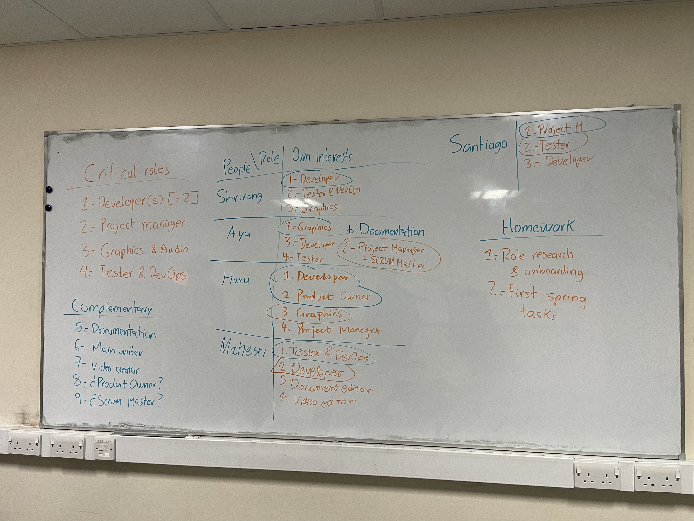

# 2025-group-13 
This is a repository for the group project of the unit **Software Engineering Discipline and Practice (COMSM0166) 2025** from the MSc Computer Science at the University of Bristol.

## Game: DINO ESCAPE

- ### Try the game: [PLAY HERE](https://uob-comsm0166.github.io/2025-group-13/).
- ### Check the code: [CODEBASE](/docs).
- ### Watch a demo: [VIDEO](https://github.com/UoB-COMSM0166/2025-group-13/blob/main/documentation/paper_prototype/dino_adventure_run.mp4) (Paper prototype video for now).

## Team

| Name | Email | Github username | Main role |
| ---- | ----- | --------------- | --------- |
| Ran Tian | jy24630@bristol.ac.uk | HaruTian4604 | Graphics & Design |
| Shrirang Lokhande | ju24635@bristol.ac.uk | ShrirangL | Software Developer |
| Mahesh Nanavare | aw24545@bristol.ac.uk | MaheshNanavare | Software Developer |
| Aya Saneh | vg24625@bristol.ac.uk | aya-codes | Project Manager |
| Santiago Muriel | ld24352@bristol.ac.uk | smurielv | Software Developer |

## Project Report

### Introduction

Dino Escape is an action-packed retro platformer inspired by classic Mario Bros gameplay, but with a prehistoric twist. Step into the claws of a determined, reddish T-Rex, racing against extinction through challenging levels and vibrant landscapes. Developed primarily using p5.js, with additional flair from HTML and CSS, Dino Escape merges nostalgic game mechanics with modern web technologies to deliver a uniquely engaging adventure. Get ready to jump, dash, and outsmart extinction!

### Requirements 

#### Ideation & early stage design
The ideation process to define our game began with a little research and brainstorming by each team member. From this we were able to identify an initial list of 13 proposals. We conducted an analysis in order to compare and evaluate our options. First, we developed each proposal to include more information on Number of Core Mechanics, Assets and Graphics, Physics Requirements, AI Requirements and Game States. Then, we evaluated each option using the following criteria: Attractiveness, Complexity Development Time, Feasibility using P5.js and User friendly.

From there, we were able to rank our choices and discuss the ones that scored the best. We then chose two very different games to validate through paper prototypes with potential users. First, we chose ‘Name of the Game’ as it was a well-known, attractive game with a good level of complexity. Secondly, we selected ‘Train of Thought’ as a simpler game to develop and play, but with an interesting purpose - to develop mental agility.

#### Reflections
During the first design stage, through user testing and feedback we were able to validate assumptions, collect new requirements, receive suggestions and broaden our understanding of the game. From this information we were able to adjust and complete the game design, based on a user-centred approach and continuous iteration.

We have reflect and learn that organizations use epics and user stories to clarify product requirements and organize work, with acceptance criteria guiding whether goals are met. Initiatives represent the highest level of long-term goals, while epics consist of multiple user stories spanning several sprints, and user stories describe achievable use cases for users within a single sprint. Teams vary in focus—some addressing minority groups early, others concentrating on the main target group first—which requires thorough research. Although templates for user stories and acceptance criteria provided initial guidance, their rigidity eventually gave way to a more flexible approach that proved particularly useful in our game development process.

### Design

- 15% ~750 words 
- System architecture. Class diagrams, behavioural diagrams.
 

### Implementation

- 15% ~750 words

- Describe implementation of your game, in particular highlighting the three areas of challenge in developing your game. 

### Evaluation

On February 25th and March 4th, our classmates evaluated our game during the lab. However, we wanted more feedback and a larger sample, so we also attended the testathon on March 5th. In preparation, we created a consent form that participants could fill, containing options such as consent to be photographed or recorded while playing or giving feedback. We also had a participant information sheet that explains our game and why we are collecting feedback and taking photos and videos. These documents can be found here.

At the testathon, we were able to receive feedback from a wide variety of players, including many who are experienced in game development. As such, we received rich and helpful qualitative feedback there. Though we did perform several Think Aloud and Heuristic evaluations, most of the feedback was given in the form of interviews with a few simple prompting questions. We prepared these questions ahead of time as a team with a focus on avoiding leading questions. Some examples of the questions are “What did you think about the visuals and graphic design?”, “What do you think the game is about?”, and “What do you imagine for the next level?”. 

The responses were analysed as follows: first, statements were categorised based on whether they were highlighting an issue or something the tester liked. Then, focusing on the issues, these were categorised further depending on which aspect of the game was concerned. Then, we counted the number of times that type of issue was mentioned. The results were that the following issues were the most pressing: jumping mechanics (10 mentions), consistency in graphics (8 mentions), need for more levels (7 mentions), lack of sound or music (6 mentions), specific animation issues (6 mentions), and unclear health indicators (5 mentions). After the testathon, two members of our team dedicated several weeks to resolving these issues, and they were able to resolve all of them. A further analysis with the specific issues mentioned can be found here. 

As for the quantitative evaluation, we developed a Google form for each of the two surveying methods we learned: the System Usability Scale (SUS) and NASA Task Load Index (TLX). We collected a large number of responses for both: 47 for the SUS and 32 for the TLX. The results we got for the SUS indicated that there was no significant difference between the levels in terms of usability. We scored above average for both levels, with an average of 82.6 for level one and 83.4 for level two. 

On the other hand, there was a definite difference for the two levels we tested in terms of task load. Based on the evaluations of eleven participants who completed the two levels in different orders, we had a W test statistic of 2, where less than 10 would indicate a statistically significant difference. On average, the task load scores were 41.4 and 59.8 percent for levels one and two respectively, indicating that level two was significantly more challenging than level one, which is in line with our aim for the two levels. 

### Process 

#### Creating a team
Although some team members already knew each other, for others it was the first interaction and for everyone it was the first time working as a team. Therefore, we consciously took time during the first meetings to get to know each other a little better, to create an atmosphere where everyone felt comfortable and to create a ‘team’ not just a working group. For example, during one of our first meetings, everyone drew a picture of their country of origin, trying to locate their hometown, while telling us a bit more about their culture and history. Besides having fun, this allowed us to improve communication and build trust.

#### Team profiling
Once we managed to ‘team up’, we did a team profiling session. Words more, words less, we spent time listening and understanding each other's interests, superpowers and areas of opportunity. 

On the other hand, we defined (after a little research) which roles would be necessary to realise a successful project. Then, with those two elements in mind, everyone proposed their order of priority for at least three of the five main roles (we mention below which roles we identified and why there are some main roles and not others). The decision had to be the result of the intersection between what we need, what I am good at, what I like to do and what I want to learn. In the first iteration of the exercise we managed to get everyone to take on their top priority role, achieving great satisfaction among the team, as no one felt they ‘had to take on that role’.

In addition, we decided to start with these roles, but to establish possible role changes after the first weeks of work in order to learn from different topics, generate a better distribution of knowledge and enrich the process with different perspectives.

#### Setting our way of work & tools
We already had a team and roles, now we had to define the way of working. We decided to adopt Agile as a philosophy and Scrum as a methodology, betting on flexibility, speed and continuous iteration. We implemented two-week sprints with two face-to-face work sessions per week (we will explain later how we arrived at this decision). Performing a Sprint Planning at the beginning and a Sprint Review and Retrospective at the end. We also decided to implement a Kanban Board to visualise, organise and follow up the tasks.
Now the missing piece was to establish the right tools. While adoption was gradual (more on this later), our technology stack was as follows.
1. GitHub: to host the central repository of the project, including all the game code, but also to achieve other interesting things.
  - GitHub Projects: to manage the Kanban board.
  - GitHub Actions: to automate the deployment of our code.
  - GitHub Pages: to host and allow to play our game online.
2. Whatsapp: to keep in touch, schedule meetings and .. sometimes share memes.
3. Google Drive: to manage all the documentation complementary to the code and what is already covered on 4. GitHub (documents, spreadsheets, pdfs, etc.).
5. Visual Studio Code: as the IDE for software development.
6. Microsoft Team: to centralise communication (discussion, reviews, etc.) and enable asynchronous work.
7. ChatGPT: to streamline information queries and speed up the learning curve for almost any subject.

#### Adjusting over the way
Regarding the implementation of Agile + Scrum, we decided to start with a one-week sprint to test the methodology and start with the first tasks in the creation of the game. We ended the sprint by running our first Sprint Review and Retrospective. It was there that we were able to adjust the methodology to our needs, defining the duration of the next sprints, replacing the daily stand-ups with face-to-face work sessions. We also decided that each sprint would be led by a different person, in order to distribute the leadership and allow several people to apply the methodology

### Conclusion

- 10% ~500 words
- Reflect on project as a whole. Lessons learned. Reflect on challenges. Future work. 

### Contribution Statement

| Name | Contribution Score (from 0 to 100) |
| ---- | ---------------------------------- |
| Ran Tian | 100 |
| Shrirang Lokhande | 100 |
| Mahesh Nanavare | 100 |
| Aya Saneh | 100 |
| Santiago Muriel | 100 |
