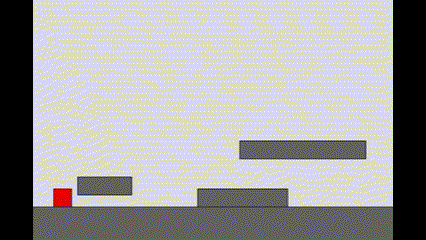
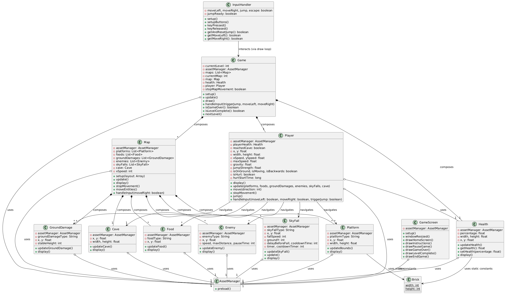
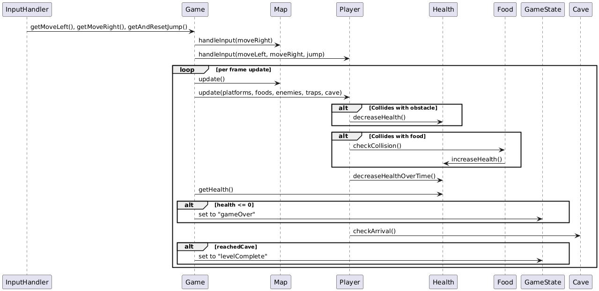

  

# Dino Escape: An Extinction Adventure Game

## ★ [Try the game](https://uob-comsm0166.github.io/2025-group-13/)
  
## ★ [Check the code](/docs)

## ★ [Watch our video](https://github.com/UoB-COMSM0166/2025-group-13/blob/main/documentation/paper_prototype/dino_adventure_run.mp4) (Paper prototype video for now)

# Table of Contents
1. [Team](https://github.com/UoB-COMSM0166/2025-group-13?tab=readme-ov-file#team)
2. [Introduction](https://github.com/UoB-COMSM0166/2025-group-13?tab=readme-ov-file#introduction)
3. [Requirements](https://github.com/UoB-COMSM0166/2025-group-13?tab=readme-ov-file#requirements)
4. [Design](https://github.com/UoB-COMSM0166/2025-group-13?tab=readme-ov-file#design)
5. [Implementation](https://github.com/UoB-COMSM0166/2025-group-13?tab=readme-ov-file#implementation)
6. [Evaluation](https://github.com/UoB-COMSM0166/2025-group-13?tab=readme-ov-file#evaluation)
7. [Process](https://github.com/UoB-COMSM0166/2025-group-13?tab=readme-ov-file#process)
8. [Sustainability, Accessibility, and Ethics](https://github.com/UoB-COMSM0166/2025-group-13?tab=readme-ov-file#sustainability,-accessibility,-and-ethics)

# Team

  
 <i><strong>Figure 1</strong>: Team photo during the first Sprint Planning session.</i>

<table align="center", style="border-collapse: collapse; text-align: center;">
 <thead>
    <tr>
     <th>Name</th>
     <th>Email</th>
     <th>GitHub Username</th>
     <th>Main Role</th>
    </tr>
 </thead>
 <tbody>
   <tr>
    <td>Ran Tian</td>
    <td>jy24630@bristol.ac.uk</td>
    <td>HaruTian4604</td>
    <td>Graphics & Design</td>
   </tr>
   <tr>
    <td>Shrirang Lokhande</td>
    <td>ju24635@bristol.ac.uk</td>
    <td>ShrirangL</td>
    <td>Software Developer</td>
   </tr>
   <tr>
    <td>Mahesh Nanavare</td>
    <td>aw24545@bristol.ac.uk</td>
    <td>MaheshNanavare</td>
    <td>Software Developer</td>
   </tr>
   <tr>
    <td>Aya Saneh</td>
    <td>vg24625@bristol.ac.uk</td>
    <td>aya-codes</td>
    <td>Project Manager</td>
   </tr>
   <tr>
    <td>Santiago Muriel</td>
    <td>ld24352@bristol.ac.uk</td>
    <td>smurielv</td>
    <td>Software Developer</td>
   </tr>
</table>

<strong>Figure 2</strong>: Table with team information.

# Introduction

 
  
 <i><strong>Figure 3</strong>: Gif showing level 1.</i>

Dino Escape is an action-packed retro platformer inspired by classic Mario Bros gameplay, but with a prehistoric twist as well as a different gameplay experience. Step into the escape of the last T-Rex, racing against extinction through challenging levels and vibrant landscapes. 

Though our game is inspired by classic platformer games, the health bar provides a slightly different experience. Firstly, users will need to pay attention to the environment and look for food, which will increase their health, and avoid dangerous elements, which will rapidly decrease it. Secondly, due to the harsh landscape that threatens the player, health will continuously run out. This adds a time element, pushing users to feel that constant threat of extinction. 

 
  
 <i><strong>Figure 4</strong>: Gif showing level 2.</i>

The extinction theme is present throughout the game: in the first part, a volcano has erupted and lava is everywhere – jump on the platforms to escape death. In the second part, your world has frozen over, and every moment you stay outside threatens your existence. While the first part is relatively easy and achievable for gamers of any skill level, the second part is far more challenging, and it has a way of keeping even experienced gamers engaged. 

The game makes use of classic keyboard controls to ease the learning curve, as well as introducing responsive development through the novelty of a mobile version. Developed primarily using p5.js, with additional flair from HTML and CSS, Dino Escape merges nostalgic gaming experience and style with modern web technologies to deliver a uniquely engaging adventure. 

# Requirements 

## Ideation & early stage design
The ideation process to choose and define our game began with every member researching and brainstorming. We then compiled an initial list of 13 proposals. We defined a few categories by which we could evaluate the complexity of each idea such as number of core mechanics or physics requirements. Then, we evaluated each option using the following criteria: Attractiveness, Complexity, Feasibility using P5.js, and User Friendliness.

  
 <i><strong>Figure 5</strong>: Table with intial game ideas.</i>

From there, we ranked our choices, discussed the ones that scored the best, and chose two very different games to validate through paper prototypes with potential users. Specifically, we chose ‘Dino Escape’ and ‘Train of Thought’.

  
 <i><strong>Figure 6</strong>: Image of the board with game ideas ranking.</i>

Based on the feedback we received, we settled on ‘Dino Escape’. First, it was clearly more intriguing to potential users who got to see and try both prototypes. Second, many of our peers pointed out that it had much more potential for expansion: new levels, different enemies, and a more salient story. 

  
 <i><strong>Figure 7</strong>: Gif showing a paper prototype of the game.</i>

Before developing the full game design and story, we did some feasibility studies to get us started on programming in this new language, to get more feedback about the game mechanics, and  to make sure we were still excited about ‘Dino Escape’. We developed our first digital prototype: 

 
  
 <i align="left"><strong>Figure 8</strong>: Gif showing the 1st digital prototype of the game.</i>
 <i align="rigth"><strong>Figure 9</strong>: Gif showing the 2nd digital prototype of the game.</i>

## Stakeholders
Having studied the Ian Alexander’s Stakeholder Onion Model, we were equipped to think much more broadly about our potential stakeholders. As we filled in the Onion diagram, we realised that this game will have an impact beyond the deadline for the report. Just as we looked to the work of previous students for inspiration, future students will look to ours. 

If we were to continue working on the game in the future, its impact will expand to new stakeholders. For example, the inner circle which is currently limited to members of Group 13, who are mainly developers, could encompass more roles such as product owners, financial advisors, marketing experts and more. 

In “Stakeholders Without Tears: Understanding Project Sociology by Modeling Stakeholders”, Ian Alexander and Suzanne Robertson discuss the concept of a stakeholder, the way of identifying stakeholders, and the continuous process of maintaining relationships with stakeholders and ensuring their involvement. The section in this article about awareness of role changes helped us understand the impact of our own role changes within the group. For us, changing roles created a more balanced sense of shared ownership of our product. 

  
 <i><strong>Figure 10</strong>: Image showing the stakeholders using the Onion Model.</i>

## Reflections
During the first design stage, through user testing and feedback we were able to validate assumptions, collect new requirements, receive suggestions and broaden our understanding of the game. From this information we were able to adjust and complete the game design, based on a user-centred approach and continuous iteration.

We have reflect and learn that organizations use epics and user stories to clarify product requirements and organize work, with acceptance criteria guiding whether goals are met. Initiatives represent the highest level of long-term goals, while epics consist of multiple user stories spanning several sprints, and user stories describe achievable use cases for users within a single sprint. Teams vary in focus—some addressing minority groups early, others concentrating on the main target group first—which requires thorough research. Although templates for user stories and acceptance criteria provided initial guidance, their rigidity eventually gave way to a more flexible approach that proved particularly useful in our game development process.

## Use Case Specifications

  
 <i><strong>Figure 11</strong>: Image showing the Use Case Diagram.</i>

## Epics and User Stories

  
 <i><strong>Figure 12</strong>: Image showing our Kanban Board.</i>

Here are a few of the user stories that shaped our game development: 
1. As a DevOps engineer, I want to configure branch protection rules for the main branch, so that I can prevent accidental force pushes, deletions and enforce pull requests before merging to maintain code integrity and stability.
2. As someone who rarely plays games, I want to control the character using right, left, up keys, so that navigation is intuitive and the learning curve is smaller when I play.
3. As an experienced gamer, I want the collisions between the player and other objects to feel realistic, so that I am not distracted by bugs in collision while playing.
4. As an amateur user, I need clear instructions on how to move the character (dinosaur) and what to pay attention to, so that I can spend less time figuring out how to play.
5. As a user with a busy schedule, I want to be able to pause and resume the game, so that I am able to play in short bursts and my progress is not lost.
6. As an avid reader and movie watcher, I want to see elements of the story as I am playing, so that I feel engaged throughout and excited to complete the game.
7. As a person who does not own a laptop, I want to be able to play the game from my phone, so that I can experience this game without needing to borrow a computer.
8. As someone with some knowledge about dinosaurs, I want to see that the extinction aspect has a basis in scientific knowledge, so that I feel the developers cared enough to learn about this area. 
9. As a lover of art, I want the visual aspect of this game to be pleasing, so that it can be enjoyable to play. 
10. As a player of several platformer games, I want this game to have an interesting twist, so that I can experience both familiarity and variety. 
11. As an environmentally-conscious gamer, I want this game to be designed with sustainability in mind, so that playing has a low impact on the environment.

In “The Use and Effectiveness of User Stories in Practice” by Garm Lucassen and others at Utrecht University, the findings from their study of user stories found that the “why” in a user story is actually necessary, though many would consider it optional (Lucassen et al., 2016). Though we often struggled to identify the reason why a user story was important, the article stresses on the importance of clarifying that reason, especially for less experienced teams. We found that searching for that reason often leads us to prioritise that user story, instead of seeing it as just another task to complete. 

# Design

- 15% ~750 words 
- System architecture. Class diagrams, behavioural diagrams.

  
 <i><strong>Figure 13</strong>: Image showing the Class Diagram.</i>

  
 <i><strong>Figure 14</strong>: Image showing the Behavioural Diagram.</i>

# Implementation

## Early Development
Development began with a minimum viable product (MVP) that laid the foundation for our 2D platformer. The MVP introduced two core functionalities essential to future iterations:

- **Persistent Rectangular Entities:** Rectangles represented key game elements—like the player and enemies—whose positions remained consistent across frames. This provided a stable interaction model.

- **Player Movement via Arrow Keys:** The player could move a rectangle using the keyboard’s arrow keys. Movement was linear and unaffected by gravity or momentum, offering a static, grid-like layout.
  
This prototype served as the sandbox where we validated our control system and logic before layering in additional mechanics.

## Challenge 1: Game Mechanics and Collision Detection
To evolve the experience from a static environment into a true platformer, we introduced two key features: gravity simulation and collision detection.

We simulated gravity by incrementally increasing the player’s vertical velocity each frame. This created a realistic free-fall effect while keeping horizontal movement unaffected.

Gravity introduced the need for a robust collision detection system. We began with bounding box collision, defining a collision when the horizontal and vertical spans of two rectangles intersected. This covered two critical cases:

- **Standing on Platforms:** When landing, the player’s bottom edge had to align with the top of a platform. We reset vertical velocity and adjusted the player’s Y-position to simulate standing still.

- **Horizontal Collisions (Walls):** For collisions with vertical surfaces, we corrected vertical positioning first, followed by horizontal adjustment to prevent wall penetration.

However, these basic rules weren’t enough. Players sometimes reset to unnatural positions after collisions. We needed a generalized solution. Our refined approach analyzed the overlap area in a collision. Later we changed the collision detection logic to depend on the player's direction of motion instead.This significantly improved consistency, and overall smoothness of the motion.

## Overcoming Challenge 1
**Visual Representation and Platform Interaction:**

With collision mechanics stabilized, we enhanced the game's visuals. Basic rectangles were replaced with sprites and textures, transforming the abstract forms into recognizable elements:

- Platforms were changed to stone blocks or grassy terrain.
- The player took on a humanoid or animated character form.

These visual improvements didn’t change mechanics but significantly improved user perception and game immersion.

**Camera Motion and Dynamic Environment:**

As our levels grew larger than a single screen, we implemented a camera system to simulate world traversal: The camera stayed static until the player crossed a horizontal threshold. After that, the world scrolled in the opposite direction of the player’s movement, creating the illusion of exploration.

We adopted one-way camera constraints inspired by Super Mario Bros.. Players could not backtrack past the starting point. The camera began scrolling once the player passed the midpoint of the screen. If the destination was already visible, full movement was permitted across the screen.

**Scalable Level Design and Layout Management:**

Initially, platform and NPC positions were hardcoded into the Map class, making the code brittle and unscalable. To overcome this, we introduced a Layout class, which:
1. Encapsulated position data for all entities across all levels.
2. Loaded layout data into the Map class at runtime, especially during level transitions.
3. Allowed new levels to be added without modifying core logic or duplicating code.

This modular approach supported **persistent game states**. Platforms and NPCs could be reloaded on pause or reset, ensuring continuity. Layouts were loaded only when needed, so performance remained unaffected—even as the number of levels grew significantly.

## Challenge 2: Enabling a Mobile Version
After the Testathon, we focused on making the game playable on mobile devices. This required addressing three major issues:

**Input Method Changes:**

The original game used keyboard input (arrow keys, spacebar). To support mobile, we built a centralized controller class capable of processing input from multiple sources—keyboard, mouse, and touch.

This required a complete refactor of input handling. Instead of checking inputs within each class, we used a central controller that ran once per frame, propagated signals, and triggered appropriate actions. We also added on-screen touchable buttons, activated only when touch capabilities were detected.

**Responsive Design and Layout:**

Our original layout was optimized for desktops. We faced challenges in extracting device characteristics and adapting visuals accordingly. We applied a combination of HTML, CSS, and p5.js to detect screen size and dynamically adjust canvas and UI elements, ensuring optimal display on any device.

**Testing Across Devices:**

Finally, as mentioned in the Testing section, we conducted continuous testing using browser developer tools and real devices, discovering bugs, solving issues and ensuring compatibility.

Overall, through iterative development, careful modularization, and responsive design, we successfully transformed a basic prototype into a scalable, cross-platform 2D platformer.

# Evaluation

To evaluate our game, we conducted qualitative evaluations using Think Aloud, Heuristic, and user interviews, as well as quantitative evaluations using the System Usability Scale and NASA Task Load Index. We used the qualitative evaluations to guide our development of new features and fine-tuning of existing features. 

On February 25th and March 4th, our classmates evaluated our game during the lab. However, we wanted more feedback and a larger sample, so we also attended the testathon on March 5th. In preparation, we created a consent form that participants could fill, containing options such as consent to be photographed or recorded while playing or giving feedback. We also had a participant information sheet that explains our game and why we are collecting feedback and taking photos and videos. 

  
 <i><strong>Figure 15</strong>: Image of the team in the Testathon.</i>

## Qualitative Evaluation
At the testathon, we were able to receive feedback from a wide variety of players, including many who are experienced in game development. As such, we received rich and helpful qualitative feedback there. Though we did perform several Think Aloud and Heuristic evaluations, most of the feedback was given in the form of interviews with a few simple prompting questions. We prepared these questions ahead of time as a team with a focus on avoiding leading questions. Some examples of the questions are “What did you think about the visuals and graphic design?”, “What do you think the game is about?”, and “What do you imagine for the next level?”. 

The responses were analysed as follows: first, statements were categorised based on whether they were highlighting an issue or something the tester liked. Then, focusing on the issues, these were categorised further depending on which aspect of the game was concerned. Then, we counted the number of times that type of issue was mentioned. The results were that the following issues were the most pressing: jumping mechanics (10 mentions), consistency in graphics (8 mentions), need for more levels (7 mentions), lack of sound or music (6 mentions), specific animation issues (6 mentions), and unclear health indicators (5 mentions). After the testathon, two members of our team dedicated several weeks to resolving these issues, and they were able to resolve all of the issues, though they decided to postpone creating more levels. 

## Quantitative Evaluation
As for the quantitative evaluation, we developed a Google form for each of the two surveying methods we learned: the System Usability Scale (SUS) and NASA Task Load Index (TLX). We collected a large number of responses for both: 47 for the SUS and 32 for the TLX. The results we got for the SUS indicated that there was no significant difference between the levels in terms of usability. We scored above average for both levels, with an average of 82.6 for level one and 83.4 for level two. On the other hand, there was a definite difference for the two levels we tested in terms of task load. Based on the evaluations of eleven participants who completed the two levels in different orders, we had a W test statistic of 2, where less than 10 would indicate a statistically significant difference. On average, the task load scores were 41.4 and 59.8 percent for levels one and two respectively, indicating that level two was significantly more challenging than level one, which is in line with our aim for the two levels. 

## Testing
For our p5.js game, we manually tested feature branches by playing in the browser to ensure new features worked and didn't break existing ones. Playtesting focused on gameplay, user experience, and performance. We documented feedback in GitHub milestones and issues for each pull request. We experimented with automated testing using GitHub Actions, but the overhead seemed disproportionate for our lightweight project, making manual testing more efficient. Our approach was primarily black-box, focusing on the player experience, though we occasionally used white-box principles for debugging. This combination of playtesting and documented feedback in GitHub facilitated iterative improvements before merging.

While developing the mobile version, we conducted continuous testing using browser developer tools and a variety of phones. Initially, only the newest devices and certain browsers could load and run the game. Through continuous real-device testing, we debugged performance issues and ensured compatibility across platforms.

# Process 

## Creating a team
As a team, we met frequently and always in person. We made use of spaces with screens or whiteboards, which we used to express and discuss our ideas. For our first few meetings, we focused on getting to know each other better, to create an atmosphere where everyone felt comfortable and part of the team. For example, during one of our first meetings, everyone drew a picture of their country of origin, trying to locate their hometown, and told us about their culture and history. 

  
 <i><strong>Figure 16</strong>: Image of team integration activity.</i>

Later, our meetings varied in content and focus, but overall we stuck to an Agile mindset and Scrum methodology and workflow. We had four sprints of one or two weeks each during which we tried to develop our game efficiently, focusing on a specific goal each time. Afterwards, we would meet to do a Sprint Review focused on what we had done, Sprint Retrospective focused on how we had worked together, and Sprint Plan for the next sprint. 

## Team profiling

One of our first meetings after getting comfortable with each other was a team profiling session. We spent time listening and understanding each other's experiences, interests, and strengths.

  
 <i><strong>Figure 17</strong>: Image of team profiling activity.</i>

We defined the necessary roles for our project, differentiating between critical roles, which would be needed throughout the project, and complementary roles, which would be needed for a specific period of time. 

We had a lengthy discussion about whether we should each work in the role we are most skilled at, or whether to explore our interests, and even discussed this with our professors. We decided it would be best to balance both, giving each other opportunities to explore new things by shuffling the roles after the second sprint. This gave each person the ability to experience something new, as well as work in a role they had experience in. At one point, someone felt that they wanted to change roles, and several team members shifted roles to make that happen. In the end, we each did some game development as well as at least one other role. 

  
 <i><strong>Figure 18</strong>: Image of team profiling activity.</i>

## Choosing our tools
Though we had great communication in person and found it easy to work together, it was harder to continue working when we were apart. We needed well-defined, simple ways to communicate. We used both Microsoft Teams and Whatsapp for communication, depending on the type of message. For coding, we used Visual Studio Code as our IDE and GitHub for collaboration and version control. Google Drive helped us organise and share our documents and Powerpoint was useful for creating simple diagrams and visual aids. 

**For communication:**

 - Whatsapp: to keep in touch, ask quick questions, and schedule meetings.
 - Microsoft Teams: to centralise communication (discussion, reviews, etc.) and enable asynchronous work.

**For coding and writing:**

 - Visual Studio Code: as our IDE for software development.
 - Google Drive: to write and edit the report, collect pictures and videos, and manage all our documentation and notes (weekly tasks, documents, spreadsheets, pdfs, etc.).
 - GitHub: to host the central repository of the project, including all the game code, but also to achieve other interesting things.
  * GitHub Projects: to manage the Kanban board.
  * GitHub Actions: to automate the deployment of our code.
  * GitHub Pages: to host and allow to play our game online.

**For designing and editing graphics and visual aids:**

 - Microsoft Powerpoint: for putting together images and making small edits on them, as well as creating diagrams for this report.

## Adjusting along the way
Regarding the implementation of Agile and Scrum, our first sprint was one week long. It was used to test the methodology and p5 language and attempt to create a first prototype of our game. We decided to have stand-up meetings four days a week to discuss any issues we were facing. Up till that point, we had been using just Whatsapp for communication outside meetings, and we hoped the stand-ups would ease communication and stress. 

After that sprint, we met for our first Sprint Review and Retrospective, and it was clear that a week-long sprint was too short and that the stand-ups were not working for us. We decided that all future sprints would last two weeks, and that we would have longer meetings twice a week. Later, we added Microsoft Teams to create a second space for communication, which created a clearer boundary between work and personal life, and we all committed to checking Teams regularly.
 
According to Martin Fowler, the essence of Agile is to be “adaptive” and “people-oriented” (Fowler, 2019). By adopting new tools when needed and choosing and changing roles for each other’s benefit, we were able to implement the core principles of Agile during this project. 

# Sustainability, Accessibility, and Ethics
The following section will cover some aspects of the environmental and technical impacts of our game. 

## Environmental Impact and Sustainability
When we see smoke rise from a chimney, fumes escape from a car exhaust, or piles of plastic sit in a landfill, we can make a direct association with the environmental impact. In comparison, the impact of digital storage is inconspicuous and invisible. 

When we began developing our game, we decided on a feature branch approach. Practically, this meant that we ended up creating a new branch for every feature we wanted to develop, then created a pull request to merge that feature branch with main. Github will add a message when a pull request is merged stating that the feature branch can now safely get deleted, but we avoided any deletions to branches or within the code, assuming that something may become useful again in the future and naively believing that there was no harm in doing so. 

  
 <i><strong>Figure 19</strong>: Image showing an overview of our Git branches.</i>

After the sessions about Sustainability and looking over the Green Software Patterns, we realised that this pattern of working was really unsustainable. For the first time, we saw that each branch was a totally separate duplicate of all our code. We added a new issue to our workflow, which was to clean up our codebase. First, we would need to delete all inactive branches, or branches where no new work was being done. Second, we noticed that a lot of our classes included segments of code that were commented out, and therefore were just cluttering our codebase without doing anything. Also, we removed any unused CSS definitions and compiled many of our images into a composite image of multiple assets. 

 
  
 <i><strong>Figure 20</strong>: Composite images of multiples game assets.</i>

When we consider the environmental impact, we also think of the carbon footprint of running our game on any device. Though this is difficult to estimate, the carbon footprints of manufacturing and using laptops and desktop computers is well-researched. According to “Environmental impact of IT: desktops, laptops and screens”, which is an article by University of Oxford’s IT services, they estimated that the cost of producing and running their standard desktop computer and screen for six years was around “778kg CO2e” (University of Oxford, 2022). The article also highlights the greater impact laptops have because of more frequent replacement. 

  
 <i><strong>Figure 21</strong>: Image showing a group of users playing our game.</i>

Interestingly, the article clarifies that “around 85 per cent results from manufacture and shipping, and just 15 per cent from electricity consumption” (University of Oxford, 2022). However, since a significant proportion of our electricity is carbon-based, any unnecessary electricity consumption should be taken seriously. The article by the University of Oxford’s IT services highlights the impact of simply using our personal computers differently: using the default power-saving modes, shutting down at the end of the day, and avoiding unnecessary charging (University of Oxford, 2022). In future versions of our game, we could include reminders to take these simple, impactful steps, or find a creative way to weave these messages into our extinction theme. 

## Technical Impact and Sustainability
According to the Sustainability Assessment Framework (SusAF), Technical sustainability comprises five aspects: maintainability, usability, adaptability, security, and scalability. For several of these aspects, the critical part is that our game is currently hosted by Github Pages in a web browser, and we have mostly tested it in mainstream browsers such as Google Chrome, Mozilla Firefox, and Microsoft Edge. If these platforms were to change in major ways, we would need to test and update our game, so this is part of the maintainability of our game: continuous testing and updating. As for security, the game does not collect or store any information, and so is not desirable for hackers. Also, all our code is available to the public through Github, so that is not a reason to attack either. In terms of scalability, our game can currently be played on multiple devices at once, but we have not tested this on a large-enough scale that we know if there are limits to this capacity. 

As for usability, the SusAF mentions how usable the product is for different users with different abilities. While designing our game, we kept in mind that not all users would be avid gamers with plenty of time and energy to learn a new game. As such, we worked to make our game intuitive and easy to learn, with simple controls and clear instructions. We have also made some adjustments to the visuals of the game, making the graphics higher contrast for easier detection of different elements as well as making all the objects slightly bigger. Importantly, a user could play and enjoy the game regardless of their ability to hear the sound effects or music. We did this by having cues like the player flashing red when losing health. If we had more time, we would add other ways to play the game without using the keyboard or touchscreen, similarly to what the 2024 group 18 did with their game, ‘Oiram’. 

# Conclusion
Though teamwork can often be a challenging experience, working on this team was rewarding for all of us. From our initial brainstorming to the final tweaks, every stage of this project taught us valuable lessons in software engineering and teamwork. This project allowed us to apply the unit’s materials, leading to deeper knowledge of the ideas and a lived experience of their implementation.

One thing we did very well was connect as a team. We had a great deal of trust between us, and our regular meetings helped to establish and maintain that strong team spirit. Integrating our branches and version control were significant challenges for our first few sprints. With time, we were able to improve our development process by adopting a set of code standards, like using name conventions, defining how to document code, and implementing a code review system.

Realising the environmental impact of digital storage and energy use encouraged us to adopt more sustainable coding practices. We actively worked to refactor our code, making the game playable on mobile devices. This made the game accessible to mobile users while also making choices that are more sustainable technically and environmentally.

Along the way, we often re-evaluated our roles to make sure work was distributed fairly, and Sprint Retrospectives were a great opportunity to do so. We learned the importance of putting the user at the center of the design process. Iteratively developing prototypes, gathering feedback, and refining our ideas helped us create a more fun and engaging experience for players.

We have overcome our two big challenges, but given enough time we could do so much more. Enhancing accessibility by offering non-tactile ways to play or adding support for screen readers would help make the game more inclusive. We would also improve the user experience by creating a full-screen mode and optimizing the performance to run smoothly on any device. Expanding the game with more levels, a bigger range of enemies, and a more developed storyline would make the experience even more immersive. Additionally, we would revisit our original idea of having multiple playable dinosaurs with different powers that a user can switch between.

  
 <i><strong>Figure 22</strong>: Image showing the design of game levels hand drawn.</i>

As for our development process, future iterations could benefit from a stronger focus on Agile practices. Specifically, we would spend more time pair programming, implement test-driven development, and automate testing and deployment. We would also explore game engines and frameworks beyond p5.js to unlock more features and boost performance. Also, we would like to develop a full application with multiplayer mode, allowing users to play online together and create herds of dinosaurs that overcome extinction.

All in all, we feel lucky to have been part of such a strong and supportive team. This project helped us grow—not just in terms of technical skills, but also in how we work with others and approach problems. 

# Contribution Statement
<table align="center", style="border-collapse: collapse; text-align: center;">
 <thead>
    <tr>
     <th>Team Member</th>
     <th>Contribution</th>
    </tr>
 </thead>
 <tbody>
   <tr>
    <td>Ran Tian</td>
    <td>20</td>
   </tr>
   <tr>
    <td>Shrirang Lokhande</td>
    <td>20</td>
   </tr>
   <tr>
    <td>Mahesh Nanavare</td>
    <td>20</td>
   </tr>
   <tr>
    <td>Aya Saneh</td>
    <td>20</td>
   </tr>
   <tr>
    <td>Santiago Muriel</td>
    <td>20</td>
   </tr>
</table>

<strong>Figure 23</strong>: Table of team contribution statement.

# References
1. Alexander, I. and Robertson, S. (no date) Stakeholders without Tears: Understanding Project Sociology by Modeling Stakeholders. Available at: https://www.scenarioplus.org.uk/papers/stakeholders_without_tears/stakeholders_without_tears.htm (Accessed: 15 April 2025).
2. Fowler, M. (2019). Agile software guide. [online] martinfowler.com. Available at: https://martinfowler.com/agile.html.
3. Lucassen, G. et al. (2016) ‘The use and effectiveness of user stories in practice’, Lecture Notes in Computer Science, pp. 205–222. doi:10.1007/978-3-319-30282-9_14.
4. University of Oxford (2022). Environmental impact of IT: desktops, laptops and screens. [online] University of Oxford. Available at: https://www.it.ox.ac.uk/article/environment-and-it.
