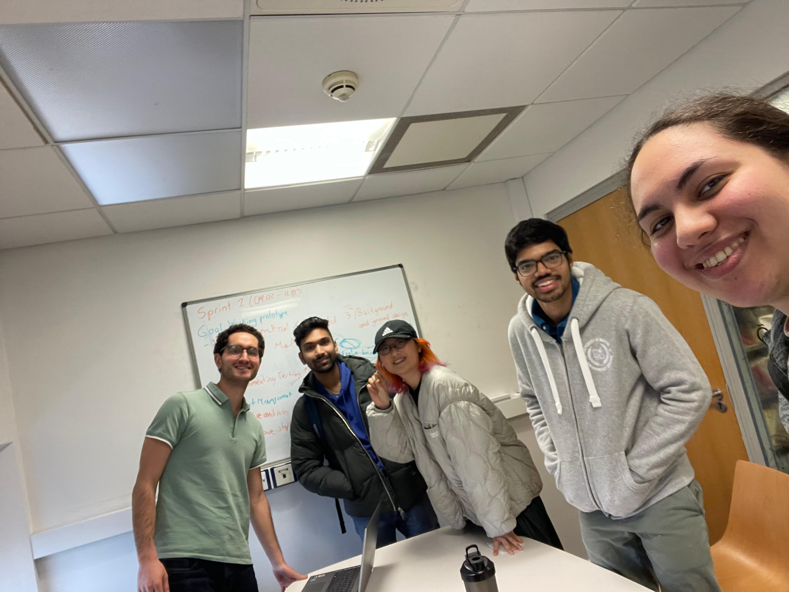
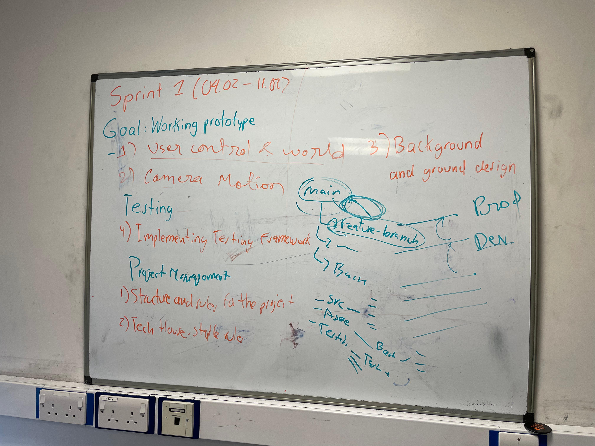
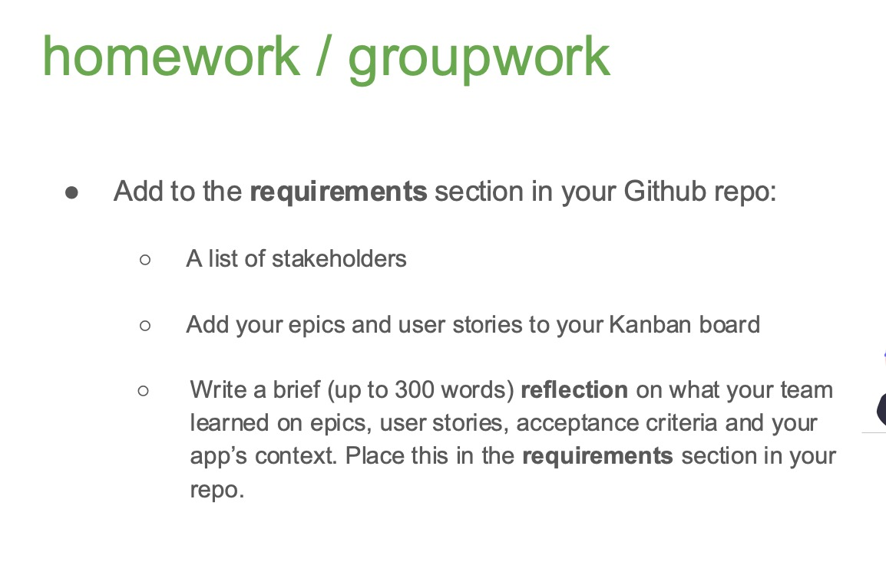

## 2025 Week4 Meeting 5

## 1. Meeting Information
- **Date**: 2025-02-04
- **Time**: 12:00
- **Location**: [Arts and Social Sciences Library Group Room 3]
- **Participants**: Haru, Shrirang, Mahesh, Aya, Santiago

---

## 2. Agenda
1. Setting up and preparing tools for our first sprint
2. Specifying goals for first sprint
3. Checking for aligned vision of how the game will look

---

## 3. Discussion Details

### Topic 1: First sprint tools
- **Key Points Discussed**:
1. Kanban location: Github
     We decided to keep it in Github and discussed which categories to have and how they will be used
2. Git branches: Feature Branch Workflow
     We decided to work on separate branches for the different features instead of everyone trying to merge with main
     See the following resources shared by Santiago:
        1. https://www.atlassian.com/git/tutorials/comparing-workflows/feature-branch-workflow
        2. https://gist.github.com/forest/19fc774dde34f77e2540
        3. https://gist.github.com/vlandham/3b2b79c40bc7353ae95a
3. Git organization: docs vs documentation
    Docs will be used for code and Documentation for all kinds of notes, minutes, etc.
   
---

### Topic 2: Assigning Sprint Goals/Major Tasks

- **Key Points Discussed**:
  Identified the necessary features for the first sprint.
  Goal: create a functioning, testable prototype.
  Tasks:
      Developers:
        - User Control (movement) and World (blocks, ground)
        - Camera Motion: Moving the visible screen when the character moves
      Graphics and Design:
        - Background and Ground: Static images
      Testing:
        - Design and implement a basic testing framework
      Project Management:
        - Structure for the project (git and timeline)
        - Tech House-Style Rules
---

### Topic 3: Movement of Character and Screen
**Decision**: Mario-style movement of character and background
- To make sure we all had the same vision, we roughly sketched the game on the board.
  This sketch was simply a rectangle box (the screen) with smaller rectangles inside for the character and blocks.
- With this sketch in front of us, we discussed whether the character or the screen would be moving.
    For example, in the dinosaur google chrome game (https://dinosaur-game.io) the dinosaur doesnt move from the left side of the screen.
    However, the environment's movement makes it seem like the dinosaur is moving.
    On the other hand, in Mario, he stays around the center of the screen, with the background moving when the right arrow is pressed.
    When the left arrow is pressed, he moves to the left of the screen but cannot go off screen.
- We decided to go for the Mario kind of character/background interaction.

---

### Topic 4: Workshop Activities

- Specified epics and user stories for case study and for our own game
- Discussed our ideas with other groups
- Personally I felt that other groups had more specific user stories, which I think is good

---

## 4. Action Items

1. **First Sprint Tasks**:
   - Refer to Kanban and photo above.

2. **Workshop Homework**:
   - Add list of stakeholders, epics and user stories to repo
   - Write a reflection on what we learned about epics etc. and specially how that relates to our app. 

---

## 5. Next Meeting
- **Date**: 2025-02-11
- **Time**: 12:00
- **Location**: [Chemistry Library Group Study Room 2]
- **Proposed Agenda**:
  1. Review First Sprint progress.
  2. Discuss testing our prototype.
  3. Discuss changing roles after first sprint.
  4. Set tasks to do before next sprint.
