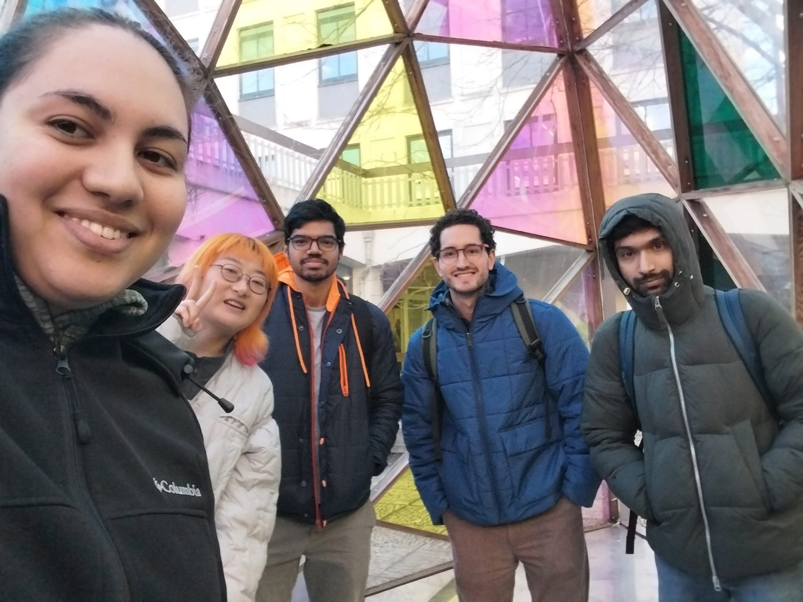

## 2025 Week4 Meeting 6

## 1. Meeting Information
- **Date**: 2025-02-06
- **Time**: 13:00
- **Location**: [Chemistry Courtyard]
- **Participants**: Haru, Shrirang, Mahesh, Aya, Santiago

---

## 2. Agenda
1. Communication and meetings
2. Git branches and role division
3. Report

---

## 3. Discussion Details

### Topic 1: Communication and meetings
**Decisions:**
1. Use Whatsapp less often for communicating tasks and important things, use it primarily to decide on meetings or if necessary between meetings
2. Use a Google Drive folder to store documents to read and tasks (not sure if this is a final decision or will be reviewed)
3. Daily stand-up meetings and one 1-hour meeting on Tuesdays 12:30 - 13:30
4. Weekly reflection during Tuesday meetings to facilitate report-writing

   
---

### Topic 2: Git branches and role division
**Key Points Discussed:**
1. Follow Feature Branch Workflow
2. Project Manager and DevOps will discuss role division related to version control further in the future

---

### Topic 3: Report
**Decisions:** 
1. Aya will write the report and manage that process
2. Write in small parts each week
3. Communication with team when info and ideas are needed to support writing
---

## 4. Action Items
1. **To read**:
   1. https://www.atlassian.com/git/tutorials/comparing-workflows/feature-branch-workflow
   2. https://gist.github.com/forest/19fc774dde34f77e2540
   3. https://gist.github.com/vlandham/3b2b79c40bc7353ae95a
   4. https://docs.google.com/document/d/1roW88F0ko_Sdx8l6cuXaJeV4EP9ibj0imOkujGUBVLU/edit?tab=t.0#heading=h.67prlu960e1o

2. **Write first part of report about epics etc**:
   - All members sent reflection to Aya
   - Will be compiled and written

3. **Work on first sprint tasks**

---

## 5. Next Meeting
- **Date**: 2025-02-11
- **Time**: 12:00
- **Location**: [Chemistry Library Group Study Room 2]
- **Proposed Agenda**:
  1. Review First Sprint progress.
  2. Discuss testing our prototype.
  3. Discuss changing roles after first sprint.
  4. Set tasks to do before next sprint.
